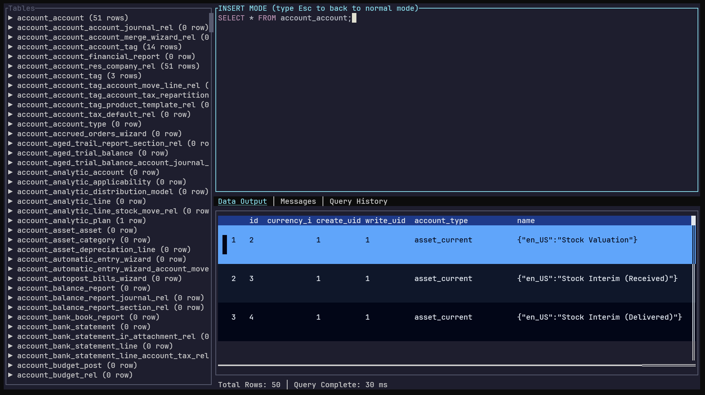

# 🐢 LazyData

> A blazing-fast, keyboard-first, terminal-based database client — inspired by pgAdmin 4, built for power users.



---

## 🚀 Why LazyData?

LazyData is a **pgAdmin 4-inspired** TUI (terminal user interface) that puts **speed, clarity, and keyboard-driven workflows** at the forefront. Whether you're exploring schemas or running complex queries, LazyData makes it feel as intuitive as using `lazygit`.

---

## ✨ Key Features

- 🧭 **Tree-view Sidebar**  
  Browse databases, schemas, tables, and more with arrow-key navigation.

- 🖋️ **Interactive Query Editor**  
  Write and execute SQL with instant feedback.

- 📊 **Smart Data Table Viewer**  
  View results in scrollable, structured tables with headers.

- ⏱️ **Live Query Stats**  
  See how many rows were returned and how long the query took.

- ⌨️ **Keyboard-First UI**  
  Designed to work efficiently without ever reaching for the mouse.

- 🔁 **Persistent Query History** _(WIP)_  
  Recall and rerun previous queries, just like a shell.

- 🔌 **Multi-Database Support** _(PostgreSQL ready)_  
  Easily extend support to other databases like SQLite, MySQL, etc.

---

## 🧰 Built With

| Library       | Purpose                           |
| ------------- | --------------------------------- |
| [`ratatui`]   | Terminal UI rendering             |
| [`sqlx`]      | Async SQL abstraction             |
| [`tokio`]     | Asynchronous runtime              |
| [`crossterm`] | Terminal key & event handling     |
| [`once_cell`] | Shared global state (e.g., stats) |

[`ratatui`]: https://docs.rs/ratatui
[`sqlx`]: https://docs.rs/sqlx
[`tokio`]: https://tokio.rs
[`crossterm`]: https://docs.rs/crossterm
[`once_cell`]: https://docs.rs/once_cell

---

## ⚡ Quick Start

```bash
# Clone the project
git clone https://github.com/yelinko20/lazydata.git
cd lazydata

# Run in debug mode
cargo run
```
